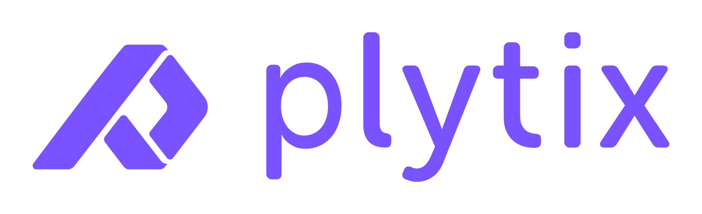
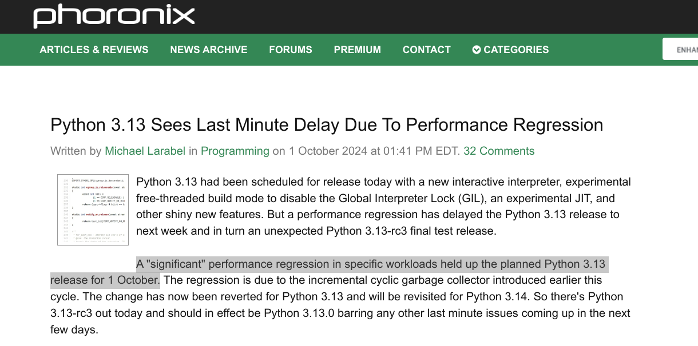

.. toctree::
   :glob:
   :hidden:

   *

.. _intro:

#####################################
¿Qué hay de nuevo en **Python 3.13**?
#####################################

.. revealjs-section::
    :data-background-color: #333333
    :data-transition-speed: default
    :data-transition: fade

.. image:: images/python-logo.*
  :width: 200

.. revealjs-notes::

  Hola a todos.

Sobre mí **Nekmo**
==================

.. revealjs-section::
    :data-background-color: #4973ff
    :data-transition-speed: slow
    :data-transition: fade

+------------------------------------+
|                                    |
| .. image:: images/cara.svg         |
|   :width: 200px                    |
|                                    |
| *Programador Python*               |
|                                    |
+------------------------------------+

.. revealjs-notes::

   Soy Juan José, más conocido en redes como Nekmo, y puede que me conozcáis de charlas anteriores para Python Málaga,
   como...

Charlas **anteriores**
======================

.. revealjs-section::
    :data-background-color: #4973ff
    :data-transition-speed: slow
    :data-transition: fade

.. revealjs-notes::

   ¿Qué hay de nuevo en Python 3.11? o ¿Qué hay de nuevo en Python 3.12? Pues bien, hoy no hay sorpresas.

¿Qué hay de nuevo en **Python 3.13**?
=====================================

.. revealjs-section::
    :data-background-color: #333333
    :data-transition-speed: default
    :data-transition: fade

.. revealjs-notes::

   Vamos a hablar de las novedades de Python 3.13. Y en esta ocasión vamos a hacerlo de la mano de PyData Málaga, con
   Plytix como colaborador.

Python Málaga + PyData Málaga
=============================

.. image:: images/pydata-malaga-logo.png
    :width: 40%

.. revealjs-notes::

   Por lo que no sólo tendremos novedades de Python 3.13, ¡también tendremos muchos datos! Veremos con números cómo de
   rápido es Python 3.13, como seguro que os gustará.

¿Más **rápido**?
================

.. revealjs-notes::

   Y es que siempre que sale una nueva versión de Python, me encanta hablar de cuááánto más rápido es. Pero en esta
   ocasión es un poco más complicado de comentar...

Python 3.13 **retrasado**
-------------------------

.. revealjs-section::
    :data-background-color: #4973ff
    :data-transition-speed: slow
    :data-transition: fade

https://www.phoronix.com/news/Python-3.13-rc3-Released

.. revealjs-notes::

   Imaginaros, que Python 3.13 se retrasó en el último minuto, por un problema de rendimiento por su recolector de
   basura, lo cual obligó a que saliese una semana más tarde.

¿Cuánto más **rápido** es?
--------------------------

.. revealjs-section::
    :data-background-color: #333333
    :data-transition-speed: default
    :data-transition: fade

.. plotly::

    import pandas as pd
    import plotly.express as px

    df_py312 = pd.read_csv('py3.12.6.csv')
    df_py313_stock = pd.read_csv('py3.13.0-stock.csv')
    df_py313_nogil = pd.read_csv('py3.13.0-nogil.csv')
    df_py313_nogil.columns = ['name', 'mean_py313_nogil', 'stddev_py313_nogil']
    df_py313_jit = pd.read_csv('py3.13.0-jit.csv')
    df_py313_jit.columns = ['name', 'mean_py313_jit', 'stddev_py313_jit']

    df_common = pd.merge(df_py312, df_py313_stock, on='name', suffixes=('_py312', '_py313_stock'))
    df_common = pd.merge(df_common, df_py313_nogil, on='name')
    df_common = pd.merge(df_common, df_py313_jit, on='name')

    # Rename the columns
    df_common.rename(columns={
        'mean_py312': '3.12',
        'mean_py313_stock': '3.13-stock',
        'mean_py313_nogil': '3.13-nogil',
        'mean_py313_jit': '3.13-jit'
    }, inplace=True)

    # Sum the 'mean' values for each dataset
    sum_py312_common = df_common['3.12'].sum()
    sum_py313_stock_common = df_common['3.13-stock'].sum()
    sum_py313_nogil_common = df_common['3.13-nogil'].sum()
    sum_py313_jit_common = df_common['3.13-jit'].sum()

    # Create a new dataframe with the aggregated results
    df_aggregated_common = pd.DataFrame({
        'Dataset': ['3.12', '3.13-stock', '3.13-nogil', '3.13-jit'],
        'Total Mean': [sum_py312_common, sum_py313_stock_common, sum_py313_nogil_common, sum_py313_jit_common]
    })

    # Create a bar plot with the aggregated results
    fig = px.bar(df_aggregated_common, x='Dataset', y='Total Mean', barmode="group")

    # Show the figure
    fig.show()

.. revealjs-notes::

   Pero finalmente salió el pasado 7 de octubre. Y sí, podemos decir que es más rápido... pero con matices. Aquí tenemos
   los datos del Python 3.13 de serie comparado con Python 3.12, aunque aquí tenemos dos versiones más, una con el
   JIT experimental, sin mucha mejora, y otra con GIL, que es incluso más lenta.

Muerte
======

(gif de situación embarazosa)

.. revealjs-notes::

   Espera, ¿cómo que ahora sin GIL es más lento? ¿Pero esto no iba a ser la releche de rápido y nos iba a salvar a
   todos?

Ahora **sin GIL**
-----------------

.. revealjs-section::
    :data-background-color: #333333
    :data-transition-speed: default
    :data-transition: fade

.. revealjs-notes::

   En realidad no hemos sido muy justos en este test, porque lo hemos probado con un solo hilo, donde el soporte sin
   GIL no es capaz de relucir su potencial. Pero si no sabéis de qué va todo esto vamos a resumirlo.

GIL
---

.. revealjs-section::
    :data-background-color: #333333
    :data-background-video: _static/traffic.mp4
    :data-background-video-loop: true
    :data-background-size: cover

.. revealjs-notes::

   El GIL, que como su nombre dice es un lock global enooorme a nivel del intérprete, es el responsable de ir cediendo
   el control entre los diferentes hilos de Python. Esto tiene cosas buenas, como que es súper fácil programar con
   concurrencia, porque simplemente no hay una concurrencia real (risas).

Cediendo el **control**
-----------------------

.. image:: images/gil_lock_example.gif
    :width: 100%

.. revealjs-notes::

   En resumen, todo se hace en un solo núcleo de tu CPU, y Python va cediendo el control con el GIL, cada vez un
   poquito a cada hilo de Python.

Un solo **núcleo**
------------------

.. revealjs-section::
    :data-background-color: #333333
    :data-background-video: _static/cpus.mp4
    :data-background-video-loop: true
    :data-background-size: cover

.. revealjs-notes::

   Lo malo y evidente de esto, es que sólo trabajamos con un único núcleo de nuestra CPU, y el resto sólo se dedican
   a animar al único que trabaja.

Python **sin GIL**
------------------

.. revealjs-section::
    :data-background-color: #333333
    :data-transition-speed: default
    :data-transition: fade

.. revealjs-notes::

   Hacer que el intérprete de Python trabaje con concurrencia es complicado, ya que dificulta su programación, teniendo
   que coordinar los hilos para que no se pisen entre ellos. Esas comprobaciones para que funcione con varios hilos,
   afecta al rendimiento con un solo hilo,

Pelea entre **hilos**
---------------------

.. revealjs-section::
    :data-background-color: #333333
    :data-background-video: _static/apu-homer-fight.mp4
    :data-background-video-loop: true
    :data-background-size: cover

.. revealjs-notes::

   Como por ejemplo qué ocurre si dos hilos quieren acceder al mismo listado al mismo tiempo, uno para eliminar un
   elemento y otro para leer ese mismo elemento. Esa coordinación es complicada y afecta al rendimiento, pero por
   contra, nuestro programa podrá aprovechar todos los núcleos de la CPU.

Python 3.13 sin GIL **con hilos**
---------------------------------

.. plotly::

    import plotly.graph_objects as go

    fig = go.Figure(go.Bar(
                x=[11.76, 92.57, 110.19],
                y=['3.13-nogil', '3.13.0', '3.12.6'],
                marker_color=['#FFD538', '#4973FF', '#4973FF'],
                orientation='h'))

    fig.update_layout(
        title='Factorial number 24 threads (lower is better) - AMD Ryzen 9 7900',
        xaxis_title='Execution Time (ms)',
        yaxis_title='Python Versions',
        yaxis=dict(
            categoryorder='total ascending'
        )
    )

    fig.show()

.. revealjs-section::
    :data-background-color: #333333
    :data-transition-speed: default
    :data-transition: fade

.. revealjs-notes::

   Como podemos ver aquí, ya en esta gráfica con varios hilos, Python 3.13 sin GIL es MUCHO más rápido que cualquier
   otra versión, porque ahora sí se aprovechan todos los núcleos de la CPU. El soporte sin GIL es una característica
   experimental, y requiere que el intérprete sea compilado con soporte para ello.

Nuevo **JIT experimental**
==========================

.. revealjs-section::
    :data-background-color: #333333
    :data-transition-speed: default
    :data-transition: fade

.. revealjs-notes::

   Lo mismo sucede con el nuevo JIT experimental, el cual requiere compilarse con soporte para ello.

Compilador **Just-In-Time**
---------------------------

.. revealjs-section::
    :data-background-color: #333333
    :data-transition-speed: default
    :data-transition: fade

.. revealjs-notes::

   Para quienes no lo conozcáis, un compilador Just-In-Time es un compilador que compila el código bytecode a código
   máquina en tiempo de ejecución, al igual que hacen la máquina virtual de Java o se hace con Numba en Python. Esto
   podría permitir en un futuro que Python sea más rápido, pero de momento la mejora ha sido bastante pequeña. Pero no
   os preocupéis, estamos sólo en el comienzo.

Python 3.13 con **JIT experimental**
------------------------------------

.. revealjs-section::
    :data-background-color: #333333
    :data-transition-speed: default
    :data-transition: fade

.. plotly::

    import pandas as pd
    import plotly.express as px

    df_py312 = pd.read_csv('py3.13.0-stock.csv')
    df_py312 = df_py312.loc[df_py312['name'].str.startswith('async_')]
    df_py313_stock = pd.read_csv('py3.13.0-jit.csv')
    df_py313_stock = df_py313_stock.loc[df_py313_stock['name'].str.startswith('async_')]

    # Merge the dataframes on the 'name' column
    df_merged = pd.merge(df_py312, df_py313_stock, on='name', suffixes=('_stock', '_jit'))

    # Rename the columns
    df_merged.rename(columns={'mean_stock': 'Stock', 'mean_jit': 'JIT'}, inplace=True)

    # Create a bar plot with separate columns for each dataframe
    fig = px.bar(df_merged, x='name', y=['Stock', 'JIT'], barmode="group", title="Comparison of Stock and JIT Means")

    # Show the figure
    fig.show()

.. revealjs-notes::

   Recuperando las gráficas de antes y ampliándolas, podéis ver que la mejora de momento es mínima. Pero podéis ir
   probándolo y reportar errores.

Mejoras en la **línea de comandos**
===================================

.. revealjs-section::
    :data-background-color: #333333
    :data-transition-speed: default
    :data-transition: fade

.. revealjs-notes::

   Pero no sólo ha habido mejoras de velocidad, ¡también han habido muchos cambios en la línea de comandos!

¡Colores!
---------

.. revealjs-section::
    :data-transition: concave
    :data-background-color: #121314

.. asciinema:: colors.cast

.. revealjs-notes::

   Para empezar, ¡ahora tenemos colores! (guauuuu).

**Copiar** y **pegar** más fácil
--------------------------------

.. revealjs-section::
    :data-transition: concave
    :data-background-color: #121314

.. asciinema:: copypaste.cast

*F2* Historial
*F3* Modo pegar

.. revealjs-notes::

   Y si habéis tenido problemas copiando y pegando de la línea de comandos, ahora es cosa del pasado. Con F2 podéis ver
   todo el histórico sin los prompts, y con F3 podéis activar el modo pegar. También se ha mejorado la edición con
   múltiples líneas cuando se recupera del historial pulsando arriba.

Modo **ayuda**
--------------

.. revealjs-section::
    :data-transition: concave
    :data-background-color: #121314

.. asciinema:: help.cast

*F1* Ayuda

.. revealjs-notes::

   Y si necesitáis consultar la documentación, ahora podéis hacerlo pulsando F1, en vez de utilizar help().

**help**, **exit** y **quit** sin paréntesis
--------------------------------------------

.. revealjs-section::
    :data-transition: concave
    :data-background-color: #121314

.. asciinema:: exit.cast

help
exit
quit

.. revealjs-notes::

   Y para más ayuda de los que están empezando, ahora las funciones de línea de comandos se pueden llamar sin
   paréntesis, para que sea aún más fácil.

Mejoras en **mensajes de error**
================================

.. revealjs-section::
    :data-background-color: #333333
    :data-transition-speed: default
    :data-transition: fade

.. revealjs-notes::

   No sólo ha cambiado la línea de comandos, sino también los mensajes de error cuando estamos programando.

Nombres de módulo **ya en uso**
-------------------------------

.. revealjs-section::
    :data-background-color: #4973ff
    :data-transition-speed: slow
    :data-transition: fade

.. revealjs-code-block:: python
    :data-line-numbers:

    $ python random.py
    Traceback (most recent call last):
      File "/home/me/random.py", line 1, in <module>
        import random
      File "/home/me/random.py", line 3, in <module>
        print(random.randint(5))
              ^^^^^^^^^^^^^^
    AttributeError: module 'random' has no attribute 'randint'
    (consider renaming '/home/me/random.py' since it has the
     same name as the standard library module named 'random'
     and the import system gives it precedence)

.. revealjs-notes::

   Por ejemplo, si llamamos a nuestro módulo como uno ya en uso, por ser del sistema o de un paquete instalado, y
   tenemos un error de importación por ello, nos sugerirá que cambiemos el nombre de nuestro módulo.

Nombre de parámetro **equivocado**
----------------------------------

.. revealjs-section::
    :data-background-color: #4973ff
    :data-transition-speed: slow
    :data-transition: fade

.. revealjs-code-block:: python
    :data-line-numbers:

    >>> "Better error messages!".split(max_split=1)
    Traceback (most recent call last):
      File "<python-input-0>", line 1, in <module>
        "Better error messages!".split(max_split=1)
        ~~~~~~~~~~~~~~~~~~~~~~~~~~~~~~^^^^^^^^^^^^^
    TypeError: split() got an unexpected keyword argument
    'max_split'. Did you mean 'maxsplit'?

.. revealjs-notes::

   También muy útil, es que si nos equivocamos en el nombre de un parámetro, y hay uno con nombre similar,
   nos sugerirá el correcto.

Mejoras en **typing**
=====================

.. revealjs-section::
    :data-background-color: #4e54c8
    :data-transition-speed: default
    :data-transition: slide

.. revealjs-notes::

   Y si utilizáis typing, también ha habido varias mejoras.

**PEP 696**: Tipos por defecto en **TypeVar**, **ParamSpec** y **TypeVarTuple**
-------------------------------------------------------------------------------

.. revealjs-section::
    :data-background-color: #4e54c8
    :data-transition-speed: default
    :data-transition: slide

.. revealjs-code-block:: python
    :data-line-numbers:

    T = TypeVar("T", default=int)

    @dataclass
    class Box(Generic[T]):
        value: T | None = None

    reveal_type(Box())                      # type is Box[int]
    reveal_type(Box(value="Hello World!"))  # type is Box[str]

.. revealjs-notes::

   Tipos por defecto en TypeVar, ParamSpec y TypeVarTuple. Esto es especialmente útil para quienes usáis los genéricos.
   Si no se define un parámetro en un genérico, ahora se puede definir un tipo por defecto, como en este ejemplo.
   Este caso de uso es común en proyectos como NumPy o TensorFlow.

**PEP 702**: Decorador **warnings.deprecated()**
------------------------------------------------

.. revealjs-section::
    :data-background-color: #4e54c8
    :data-transition-speed: default
    :data-transition: slide

.. revealjs-code-block:: python
    :data-line-numbers:

    from warnings import deprecated

    @deprecated("It is pining for the fiords")
    def norwegian_blue(x: int) -> int: ...

    @deprecated("Use Spam instead")
    class Ham: ...

    class Spam:
        @deprecated("There is enough spam in the world")
        def __add__(self, other: object) -> object: ...

.. revealjs-notes::

   El nuevo decorador deprecated() de la librería warnings, nos permite marcar funciones, clases o métodos como
   obsoletos, mostrándose por defecto un mensaje de advertencia cuando se utilizan. Adicionalmente, los validadores de
   tipos como mypy también mostrarán una advertencia.

**PEP 705**: Sólo lectura en **TypedDict**
------------------------------------------

.. revealjs-section::
    :data-background-color: #4e54c8
    :data-transition-speed: default
    :data-transition: slide

.. revealjs-code-block:: python
    :data-line-numbers:

    from typing import NotRequired, ReadOnly, TypedDict

    class Movie(TypedDict):
        name: ReadOnly[str]
        year: ReadOnly[NotRequired[int | None]]

.. revealjs-notes::

   Esta nueva característica es especialmente útil para quienes utilicéis TypedDict, como es mi caso. Ahora es posible
   marcar ciertas claves como de sólo lectura, en aquellos diccionarios que está previsto que sean modificados. Para
   ello, contamos con el nuevo tipo ReadOnly.

**PEP 742**: TypeIs
-------------------

.. revealjs-section::
    :data-background-color: #4e54c8
    :data-transition-speed: default
    :data-transition: slide

.. revealjs-code-block:: python
    :data-line-numbers:

    from typing import TypeIs

    def is_int(x: object) -> TypeIs[int]:
        return isinstance(x, int)

.. revealjs-notes::

   Por último, tenemos TypeIs. Este caso es bastante específico, siendo una alternativa a TypeGuard. Es útil en
   funciones que devuelven True o False en función a un tipo. Si el objeto que pasamos a la función es igual al tipo
   que ponemos dentro del TypeIs, será True. Si no, será False. Así de simple.

**PEP 667:** Mejoras en **locals()**
====================================

.. revealjs-section::
    :data-background-color: #4973ff
    :data-transition-speed: slow
    :data-transition: fade

.. revealjs-code-block:: python
    :data-line-numbers:

    class C:
        x = 1
        sys._getframe().f_locals['x'] = 2
        print(x)  # Print 2

    def f():
        x = 1
        sys._getframe().f_locals['x'] = 2
        print(x)  # Print 1
    f()

.. revealjs-notes::

   Pasando a otro tema, también ha habido cambios importantes en locals(). Hasta ahora, el locals() se obtenía en
   tiempo real, y su modificación podía tener efectos indeseados. No sólo esto, sino que también era bastante lento.
   Ahora se ha cambiado su implementación, haciéndolo más consistente y rápido. Para los usuarios finales no tendrá
   implicaciones, pero para quienes usen la API en C, supone utilizar nuevas llamadas.

Otros **cambios**
=================

.. revealjs-section::
    :data-background-color: #333333
    :data-transition-speed: default
    :data-transition: fade

* Nueva excepción ``PythonFinalizationError``, si hay bloqueos durante finalización.
* ``argparse`` ahora soporta marcar como obsoleto comandos, argumentos...
* Soporte para codificación z85, usada por ZeroMQ o Git, en el módulo ``base64``.
* ``copy.replace()`` copia y reemplaza del objeto copiado.
* El módulo ``random`` ahora incluye **línea de comandos**.

.. revealjs-notes::

   También ha habido otros cambios, los cuales nombraremos rápidamente. (leer).
   TODO: no cabe
   * ``dbm.sqlite3`` ahora es el motor por defecto de ``dbm``.
    * El módulo ``os`` ahora incluye nuevas funciones *time file descriptors*.

Eliminaciones
=============

.. revealjs-section::
    :data-background-color: #333333
    :data-transition-speed: default
    :data-transition: fade

* Eliminación de módulos muertos de stdlib: ``aifc``, ``audioop``, ``cgi``, ``cgitb``, ``chunk``, ``crypt``...
* Eliminado **2to3** y **lib2to3** (obsoleto desde 3.11).
* Eliminado ``tkinter.tix`` (obsoleto desde 3.6).
* Eliminada ``locale.resetlocale()``
* Eliminados ``typing.io`` y ``typing.re``.
* Eliminados los descriptores tipo ``__get__`` y ``__set__`` de ``@classmethod``.

.. revealjs-notes::

   Pero no sólo se han añadido y mejorado cosas. También se han eliminado (leer). De los módulos eliminados, me
   gustaría destacar los módulos obsoletos de stdlib y lib2to3, que nos alejan un poco más de Python 2. Demos un
   aplauso por ello.

Aplausos módulos muertos y 2to3
-------------------------------

.. revealjs-section::
    :data-background-color: #333333
    :data-transition-speed: default
    :data-transition: fade

(Imagen defunción de módulos).

.. revealjs-notes::

   Gracias a todos.

Plataformas **soportadas**
==========================

.. revealjs-section::
    :data-background-color: #333333
    :data-transition-speed: default
    :data-transition: fade

* **PEP 730:** iOS está oficialmente soportado (tier 3).
* **PEP 738:** Android está oficialmente soportado (tier 3).
* **wasm32-wasi** pasa a ser tier 2.
* **wasm32-emscripten** ya no está oficialmente soportado.

.. revealjs-notes::

   También ha habido cambios en las plataformas soportadas. (Leer)

Minuto de silencio
------------------

.. revealjs-section::
    :data-background-color: #333333
    :data-transition-speed: default
    :data-transition: fade

.. revealjs-notes::

   Y ahora, un minuto de silencio por wasm32-emscripten, que ya no está soportado.

**Listado** completo de **cambios**
===================================

.. revealjs-section::
    :data-background-color: #333333
    :data-transition-speed: default
    :data-transition: fade

https://docs.python.org/3/whatsnew/3.13.html

.. revealjs-notes::

   Y para que no quedase muy larga la presentación, ha habido algunos cambios que he omitido, pero en la página oficial
   tenéis el listado completo.

¿Cuál es vuestra **mejora favorita**?
=====================================

.. revealjs-section::
    :data-background-color: #4973ff
    :data-transition-speed: slow
    :data-transition: fade

.. revealjs-notes::

    Y tras todo esto, ¿cuál ha sido vuestro cambio favorito?

¡Muchas gracias a todos!
========================

.. revealjs-section::
    :data-background-gradient: linear-gradient(-45deg, #ee7752, #e73c7e, #23a6d5, #23d5ab);

.. revealjs-notes::

    Y ante todo, ¡Muchas gracias a todos!

PyData
======

.. image:: images/pydata-malaga-logo.png
    :width: 60%

.. revealjs-notes::

   Y a PyData Málaga por hacer posible esta charla.

Plytix
======

.. revealjs-notes::

   Y a Plytix por su patrocinio.

Pyzzas
======

.. image:: images/pizza.svg
    :width: 60%

.. revealjs-notes::

   Y por las pizzas de después.

Python **Málaga**
=================

.. revealjs-section::
    :data-background-color: #4973ff
    :data-transition-speed: slow
    :data-transition: fade

* 🤝 **Meetup:** `Python Málaga <https://www.meetup.com/es-ES/Python-Malaga/>`_.
* 🌐 **Sitio web:** `python-malaga.es <https://www.python-malaga.es/>`_.
* 🐦 **Twitter:** `@PythonMalaga <https://twitter.com/python_malaga>`_.
* ‍💼 **LinkedIn:** `Python Málaga <https://www.linkedin.com/groups/13110576/>`_.
* 💬 **Telegram:** `Python Málaga <https://t.me/python_malaga>`_.

.. revealjs-notes::

   Para más charlas como esta, tenéis disponible nuestra comunidad de Python Málaga, a la cual podéis uniros en (leer).

QR
==

.. revealjs-section::
    :data-background-color: #4973ff
    :data-transition-speed: slow
    :data-transition: fade

.. revealjs-notes::

   Y si queréis ver de nuevo esta presentación, la tenéis disponible en el código QR.

**Contactar**
-------------

.. revealjs-section::
    :data-background-color: #333333
    :data-transition-speed: default
    :data-transition: fade

* 🌐 **Sitio web:** `nekmo.com <https://nekmo.com>`_
* 📫 **Email:** `contacto@nekmo.com <mailto:contacto@nekmo.com>`_
* 🐦 **Twitter:** `@nekmocom <https://twitter.com/nekmocom>`_
* 📱 **Telegram:** `@nekmo <https://t.me/nekmo>`_
* 💡 **Jabber:** `nekmo@nekmo.org <xmpp://nekmo@nekmo.org>`_

.. revealjs-notes::

   A cualquier cosa, tenéis mi contacto disponible.
